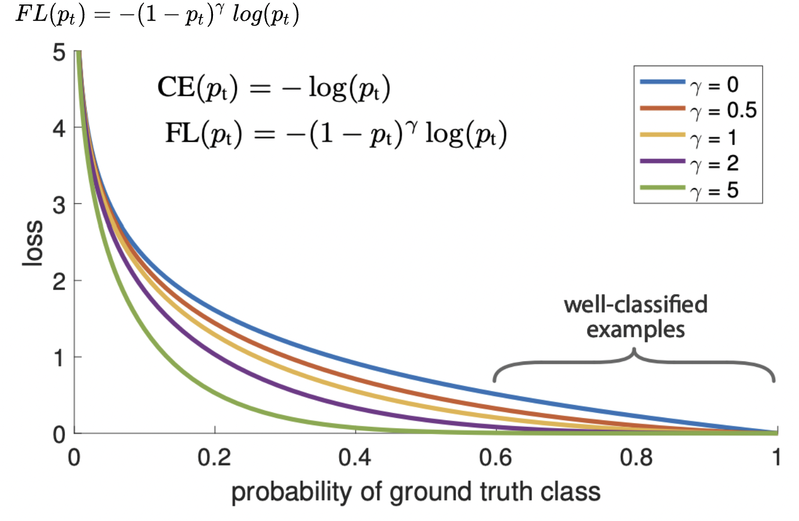
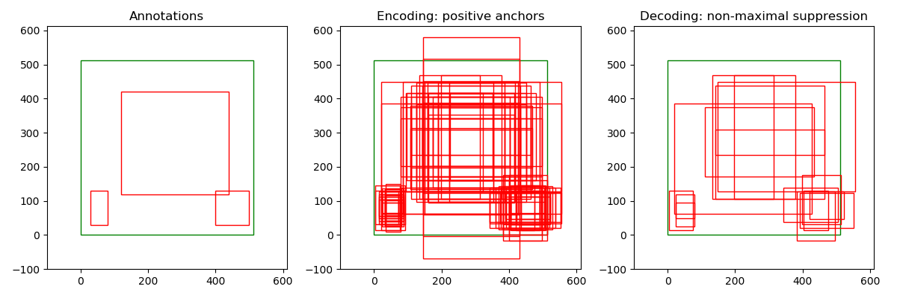

# PyTorch-RetinaNet
Train _RetinaNet_ with _Focal Loss_ in PyTorch.

Reference:  
[1] [Focal Loss for Dense Object Detection](https://arxiv.org/abs/1708.02002)  

#### **正负样本**

在ROI RPN过程中，整个图像中，正样本的区域少，大部分是负样本，因此，要处理好正负样本不平衡问题，网络提取特征，feature中的绝大多数都是negative，只有和ground truth，iou较高的区域，才被assign为positive sample。因此，2000个proposal，几十个是positive，大多数是negative，极度不平衡。此时，就有一些正负样本采样的方法，提出来。anchor 和gt的最大iou，大于某个a阈值，为positive，anchor 和gt的最大iou 小于 某个b阈值，为negative。对于没有被分配到anchor的gt，分配任何一个与他iou 大于某个c阈值的gt。确保每个gt都有一个或多个anchor对应。其他的是ignore。

positive，negative，比例1:3。这是roi的选择，rpn阶段，同理，rcnn阶段，再进行样本采样。 然后，再进行特征提取，做classification和regression。让模型学到有用的特征。

都会在loss里， 进行处理。负样本，直接在loss里面。如果负样本太多，虽然大多数容易分对，但是对loss的贡献很大，导致正样本难以处理。

> 对于目标检测算法，主要需要关注的是对应着真实物体的**正样本**，在训练时会根据其loss来调整网络参数。相比之下，**负样本对应着图像的背景，如果有大量的负样本参与训练，则会淹没正样本的损失，从而降低网络收敛的效率与检测精度。**


回归方式：从点回归，还是anchor回归。anchor free， anchor based问题的一些区别：**.正负样本定义；2.回归分支中从point回归还是从anchor回归**。从point回归就是指的每个点预测距离4条边的距离模式，而从anchor回归是指的retinanet那种基于anchor回归的模式。  **说明正负样本定义的不同是决定anchor-base和anchor-free的本质区别。**


**RetinaNet 特点：**(1) 多尺度预测输出；(2) 采用FPN结构进行多层特征图融合。 网络进行多尺度预测，尺度一共是5个，每个尺度共享同一个head结构，但是分类和回归分支是不共享权重的。


**难易样本**

在loss里面，调节，最著名的是focal loss。对预测概率高的，减少loss，对概率低的，增加loss。抑制简单样本对loss的贡献，加大难样本对loss的贡献。难易样本主要是通过调节loss处理。难分，易分。


- 是人为设置的超参
  - 越大，难/易样例权重差异就越大
  - 当时，Focal Loss退化为Cross Entropy
  - 在论文的实验中，时表现最佳
- 权重会随着正确分类的置信度变化
  - 当比较大时，正确分类的置信度高，属于易样例，权重就比较小
  - 当比较小时，正确分类的置信度低，属于难样例，权重就比较大




#### 正负样本划分

RetinaNet FPN 这个结构，对label的编码，是包含在正负样本定义中的。

所有的anchor，计算和gt box的iou。如果与某个anchor与 gt box 的iou，大于0.5， 为正样本1，

如果anchor 的最大iou，小于0.4，为负样本，0。

如果anchor与gt的iou>0.4, <0.5，分配为ignore样本，忽略样本，-1。

一共9个anchor，分别是1:2， 2:1， 1:1， aspect ratio为1,  2^(1/3), 2^(2/3)

**分类：**

> **classification: focal loss, ignore cases where cls_tgt == -1**，**只负责0,1正负样本的回归。**
>
> pos_neg = cls_targets > -1
>
> 给正样本打标签的时候，是将1给到指定的那个class下，为1，其他为0。也就是一个grid位置下的相同形状anchor，只有第i个类别的target为1，其他为0。

> ```python
> 	
>     (num_classes, num_anchors, fmh, fmw)
>     (4, num_anchors, fmh, fmw)
>     
>     Classification targets are defined as
>     -  1 if IoU with the anchor box in [0.5, 1.0] (positive label)
>     - -1 if IoU with the anchor box in [0.4, 0.5] (to be ignored in the loss)
>     -  0 if IoU with the anchor box in [0.0, 0.4] (negative label)
> ```


**回归的target为**：只负责1：pos样本，也就是正样本anchor的回归。

> **regression: include all anchor boxes where *any* class is positive**

```python
    pos_loc = cls_targets > 0  
    tx = (x - anchor_x) / anchor_w
      ty = (y - anchor_y) / anchor_h
      tw = log(w / anchor_w)
      th = log(h / anchor_h)
```

>         Classification targets are defined as
>         -  1 if IoU with the anchor box in [0.5, 1.0] (positive label)
>         - -1 if IoU with the anchor box in [0.4, 0.5] (to be ignored in the loss)
>         -  0 if IoU with the anchor box in [0.0, 0.4] (negative label)

两个gt box，分别是两类，分别为 类别1,2。则编码出来的，是与其 iou最大的anchor box，其负责这一类的分类与回归。例如：第i个anchor，负责第1类，则[0, 1, 0] one hot 编码。 第j个anchor 负责第2类，则[0, 0, 1]。只需要对应的[第i类，第几个anchor，anchor的grid的位置h，anchor所在的grid位置w]=1。



计算loss的时候，只需要负责处理target为0,1样本，忽略掉ignore样本。

由于RetinaNet采用了Focal Loss进行正负样本的平衡，所以没有使用采样的方法，来平衡样本。

min_pos_iou=0，可以保证每个GT一定有对应的anchor负责预测。0.4以下是负样本，0.5以上且是最大Iou的anchor是正样本0.4~0.5之间的anchor是忽略样本。其不需要正负样本采样器，因为其是通过平衡分类loss来解决的。
